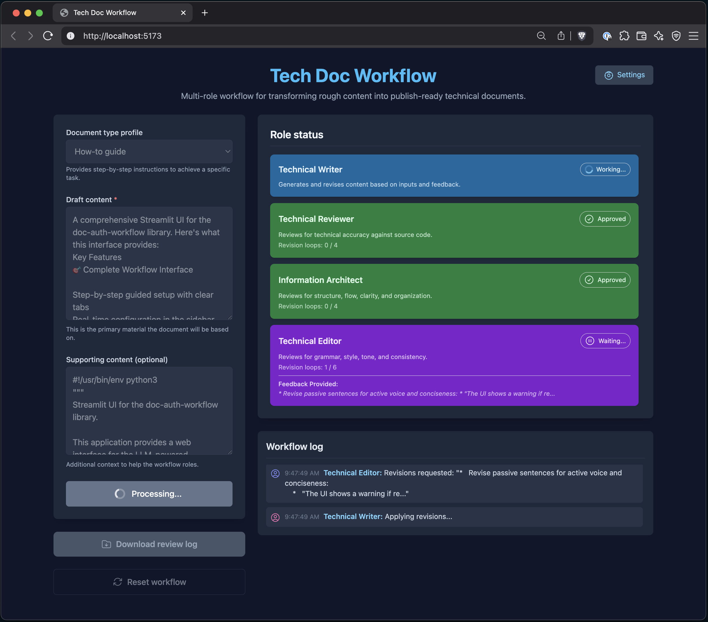
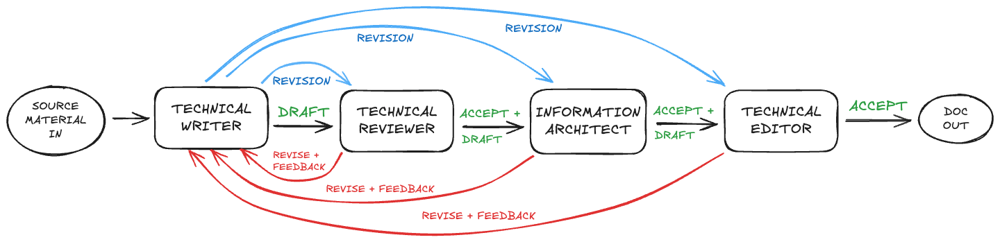

# Tech Doc Workflow

Demonstration of using the [evaluator-optimizer workflow](https://www.anthropic.com/engineering/building-effective-agents#workflow-evaluator-optimizer) for technical documentation authoring. Built with Google AI Studio and Claude Code.

## Prerequisites

- Node.js 18 or later
- npm (bundled with Node.js)

## Workflow roles

## Run the app locally

1. Install dependencies: `npm install`
2. Run the app: `npm run dev`
3. Configure your API keys through the application's settings interface

For detailed setup instructions, see [docs/run-app-locally.md](./docs/run-app-locally.md).
