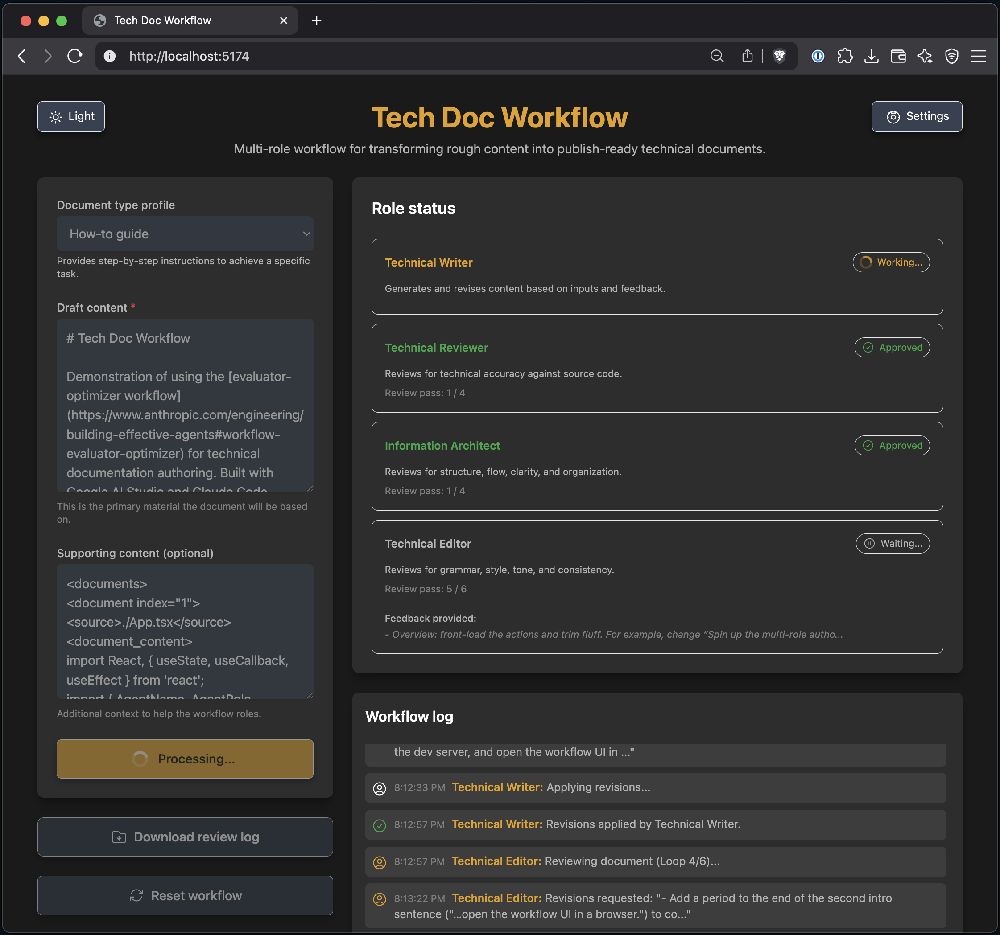

# Tech Doc Workflow

Demonstration of using the [evaluator-optimizer workflow](https://www.anthropic.com/engineering/building-effective-agents#workflow-evaluator-optimizer) for technical documentation authoring. Built with Google AI Studio and Claude Code.

## Prerequisites

- Node.js

## Workflow roles

## Run the app locally

1. Install dependencies: `npm install`
2. Set `GEMINI_API_KEY=YOUR_KEY_HERE` enivronment variable (replace `YOUR_KEY_HERE` with your Gemini API key)
3. Run the app: `npm run dev`
